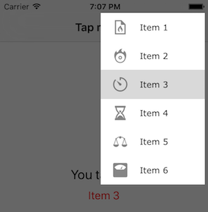

# ASJOverflowButton

Working on projects that are simultanously being developed on both iOS and Android can post interesting challenges, especially concerning the look and feel of both apps. There are standard controls on both platforms that are not available in the other. Overflow menu is one of them. This library is a `UIBarButtonItem` subclass that you can put on a navigation bar and an overflow menu will be presented on its tap.

# Installation

Cocoapods is the preferred way to install this library. Add this command to your `Podfile`:

```
pod 'ASJOverflowButton'
```

# Usage

Use the designated initialiser to create the button, like so:

```objc
ASJOverflowButton *overflowButton = [[ASJOverflowButton alloc] initWithTarget:aTarget image:anImage items:someItems];
self.navigationItem.rightBarButtonItem = overflowButton;
```

The items need to be on type `ASJOverflowItem`. Constructor method is provided to generate them. Just attach an array of these during initialisation.

```objc
ASJOverflowItem *item = [ASJOverflowItem itemWithName:itemName image:image];
```

The are a few properties to customise the look and feel of the overflow menu.

```objc
@property (assign, nonatomic) BOOL shouldDimBackground;
@property (strong, nonatomic) UIColor *menuBackgroundColor;
@property (strong, nonatomic) UIColor *itemTextColor;
@property (strong, nonatomic) UIFont *itemFont;
```



### Limitation
Can ONLY show the overflow menu on the top right corner of the screen.

### To-do
- ~~Menu closes abruptly when tapped outside~~
- Menu should close when tapped on the clear table view outside the items (BUG)
- Allow a menu to be created with a title
- Some way to adjust width of the menu
- Maybe some way to show menu on both, left and right sides?

### Thanks

- To [this answer from Stack Overflow](http://stackoverflow.com/questions/11570160/uitableview-passes-touch-events-to-superview-when-it-shouldnt) which helped me fix an issue where taps on overflow menu's items would be consumed by the background view's tap gesture.

# License

ASJOverflowButton is available under the MIT license. See the LICENSE file for more info.
