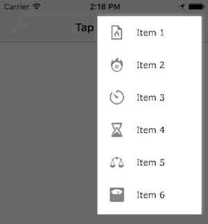

# ASJOverflowButton

Working on projects that are simultanously being developed on both iOS and Android can post interesting challenges, especially concerning the look and feel of both apps. There are standard controls on both platforms that are not available in the other. [Overflow menu](https://developer.android.com/design/patterns/actionbar.html) is one of them. This library is a `UIBarButtonItem` subclass that you can put on a navigation bar and an overflow menu will be presented on its tap.

# Installation

CocoaPods is the preferred way to install this library. Add this command to your `Podfile`:

```ruby
pod 'ASJOverflowButton'
```

# Usage

Use the designated initializer to create the button, like so:

```objc
ASJOverflowButton *overflowButton = [[ASJOverflowButton alloc] initWithImage:anImage items:someItems];
self.navigationItem.rightBarButtonItem = overflowButton;
```

The items need to be on type `ASJOverflowItem`. Constructor method is provided to generate them. Just attach an array of these during initialization.

```objc
ASJOverflowItem *item = [ASJOverflowItem itemWithName:itemName image:image backgroundColor:color];
```

The are a few properties to customize the look and feel of the overflow menu.

```objc
@property (nullable, strong, nonatomic) UIColor *menuBackgroundColor;
```
Sets the background color of the overflow menu. Defaults to white.

```objc
@property (nullable, strong, nonatomic) UIColor *itemTextColor;
```
Sets the text color of the menu items. Defaults to black.

```objc
@property (nullable, strong, nonatomic) UIColor *itemHighlightedColor;
```
Sets the menu item's background color when tapped. Defaults to RGB (217, 217, 217).

```objc
@property (nullable, strong, nonatomic) UIFont *itemFont;
```
Sets the font of the menu items. Defaults to system font of size 17 pts.

```objc
@property (assign, nonatomic) BOOL hidesSeparator;
```
Hides the separator between two menu items. Needs to be set `NO` for `separatorInsets` property to work. Defaults to `YES`.

```objc
@property (assign, nonatomic) BOOL hidesShadow;
```
Hides the shadow around the menu. Defaults to `NO`.

```objc
@property (assign, nonatomic) BOOL dimsBackground;
```
Dims the background when menu is showing. Defaults to `NO`.

```objc
@property (assign, nonatomic) CGFloat dimmingLevel;
```
Sets the degree to which the background is dimmed when menu is shown. Will work only if `shouldDimBackground ` is set to `YES`. Ranges from 0.0 to 1.0. Defaults to 0.6.

```objc
@property (assign, nonatomic) CGFloat menuItemHeight;
```
Sets the height of individual overflow menu items. Defaults to 40 pts.

```objc
@property (assign, nonatomic) CGFloat widthMultiplier;
```
A ratio to set the menu width with respect to the screen width. Acceptable values are from 0.0 to 1.0. For example, if your screen width is 320.0 pts and 'widthMultiplier' is set to 0.5, the menu width will be 0.5 * 320.0 = 160 pts. Defaults to 0.4.

```objc
@property (assign, nonatomic) SeparatorInsets separatorInsets;
```
Sets the left and right insets of the separator between two menu items. Works only if `hidesSeparator` is set to 'NO'. Defaults to (15.0f, 0.0f).

```objc
@property (assign, nonatomic) MenuMargins menuMargins;
```
Sets the margins of the menu from the top, right and bottom edges of the screen. Menu will always appear below the status bar. Defaults to 5 pts each.

```objc
@property (assign, nonatomic) MenuAnimationType menuAnimationType;
```
Sets the way the menu should be shown. There are two options, fading it in or zooming in from the top right corner. Defaults to `MenuAnimationTypeZoomIn`.




### Limitation

Can only show the overflow menu on the top right corner of the screen. From [release 1.2](https://github.com/sudeepjaiswal/ASJOverflowButton/releases/tag/1.2) however, you can adjust the `menuMargins` property to change the menu position.

# To-do

- ~~Menu closes abruptly when tapped outside~~
- ~~Menu should close when tapped on the clear table view outside the items~~
- ~~Allow a menu to be created with a title~~
- ~~Some way to adjust width of the menu~~
- Maybe some way to show menu on both, left and right sides
- Gradient at bottom to hint scrolling

# Credits

- To [Shashank Pali](https://github.com/shashankpali) to make the menu zoom in code work - Read a [blog post](http://shashankpali.weebly.com/posts/scale-view-from-anywhere-cgaffinetransform) about it
- [UITableView passes touch events to superview when it shouldn't](http://stackoverflow.com/questions/11570160/uitableview-passes-touch-events-to-superview-when-it-shouldnt)
- [Can i change multiplier property for NSLayoutConstraint?](http://stackoverflow.com/questions/19593641/can-i-change-multiplier-property-for-nslayoutconstraint#comment54574185_27831003)
- [Which is the best way to suppress “unused variable” warning?](http://stackoverflow.com/questions/17622237/which-is-the-best-way-to-suppress-unused-variable-warning)

# License

`ASJOverflowButton` is available under the MIT license. See the LICENSE file for more info.
